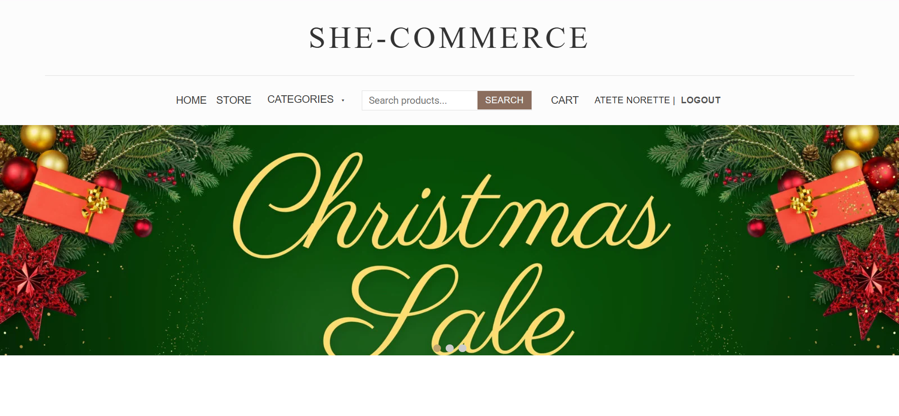
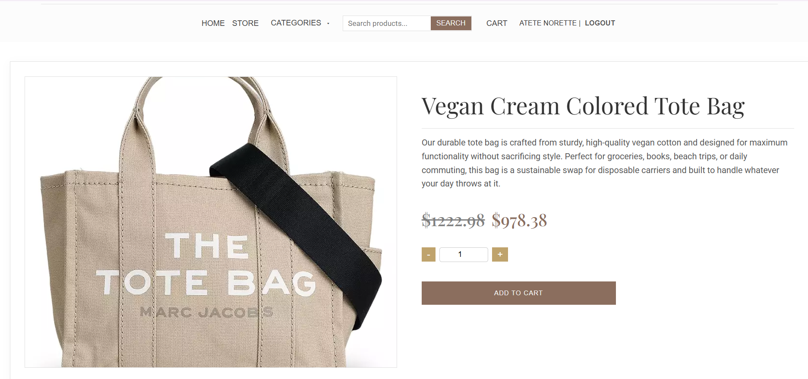
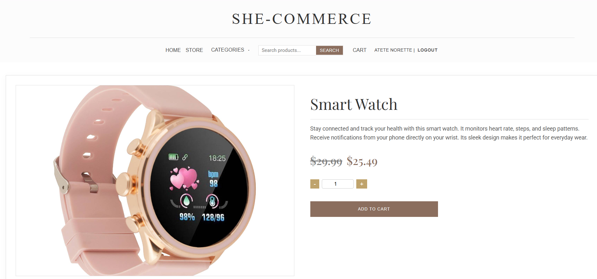
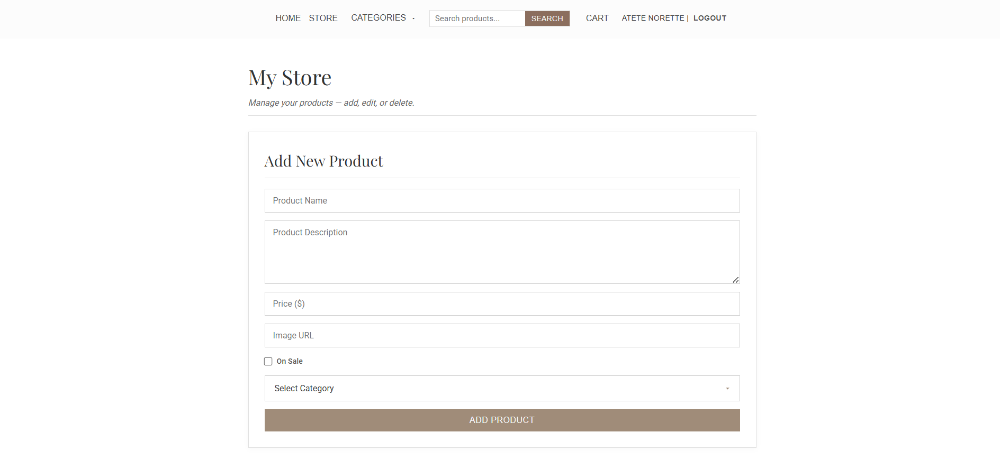
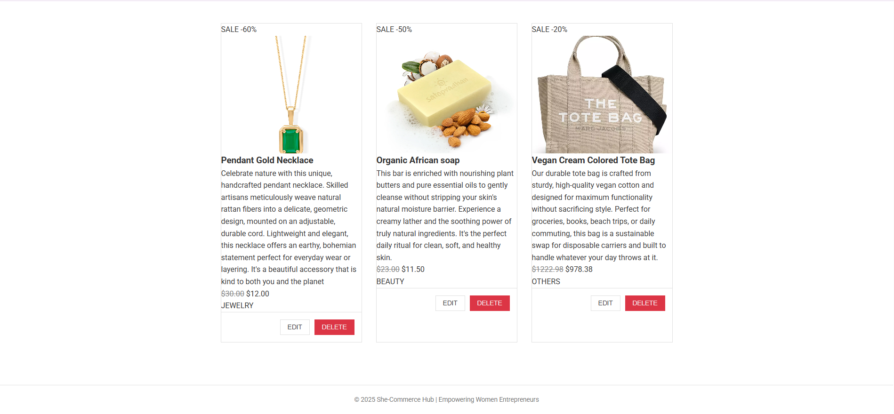
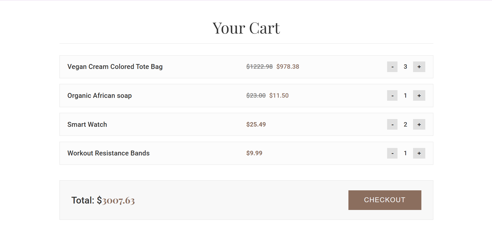
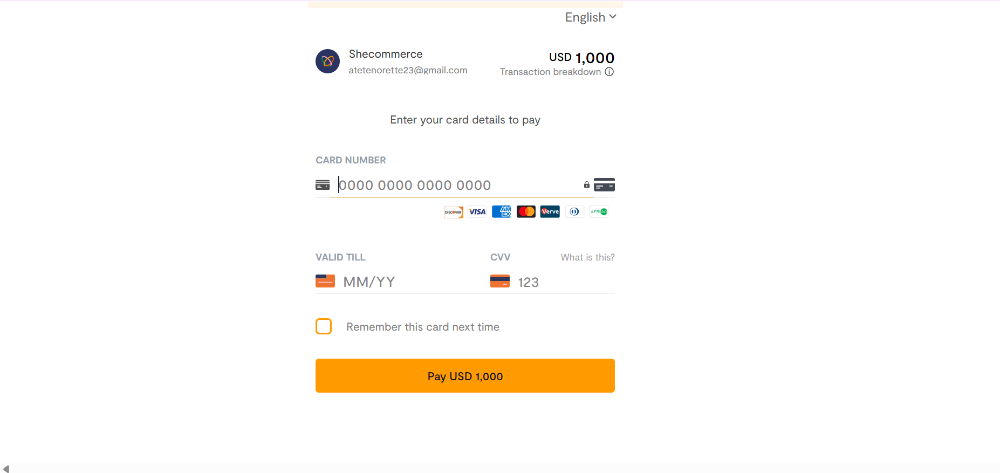

# She-Commerce Hub

A full online marketplace built with HTML, CSS, JavaScript, and MongoDB, featuring category filtering, live product search, cart management, admin product control, and Flutterwave checkout integration.

## Tech Stack
### Frontend:
- HTML
- CSS
- JavaScript (Vanilla)

### Backend

- Node.js
- Express.js
- MongoDB

## Main Features

1. Full Marketplace UI
Beautiful product grid layout with modern design.

2. Category Filtering
Products instantly filter by:
Technology, Jewelry, Beauty, Sports, Others

3. Search Bar (Live Filtering)
Typing in the search bar dynamically filters the products on the home page.

4.  Shopping Cart System
Add/remove products, Quantity update, Real-time total updates, Discounted items correctly calculated

5. Checkout Integration
All checkout redirects to Flutterwave payment page.

6. User Authentication
Login, Register, Form validation

7. Store Owners
Add new products, Edit existing products, Update images, prices, discounts, and categories

### screenshots

- Home page

- Product page

- Store Page

- Cart Page

- Checkout Form (powered by Flutterwave)

## Getting started

1. clone the Repository `git clone https://github.com/yourusername/Shecommerce-Hub.git`
2. change to the directory `cd Shecommerce-Hub`
3. Install the Backend Dependencies `cd backend` then use code `npm install`

4. Start the Backend Server `npm run dev`

5. After starting the backend server successfully you can use the vscode Live server to view frontend/index.html file. **OR** go to the project link "https://shecommerce-hub.vercel.app/index.html" and Refresh the page until you see the backend products.

### Author
She-Commerce Hub by Atete Norette
